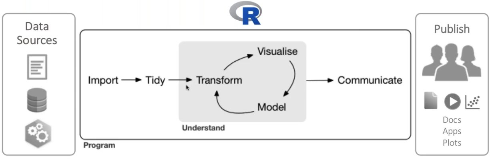
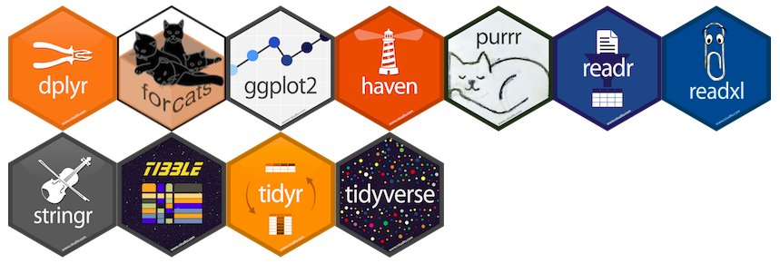

# Wim van der Ham 

(wfjvdham@gmail.com)

Experiencia:

- Mercadoni
- Globant
- Quby

Master Human Media Interaction (AI)

# Ustedes?

1. Cual es tu experiencia?
1. Que tu quieres aprender?

# Remarcas

- Flexible
- Práctico con ejemplos
- Los términos técnicos estarán en Español / Inglés

# Fuentes

- https://www-bcf.usc.edu/~gareth/ISL/
- https://www.kaggle.com/
- https://trevorstephens.com/kaggle-titanic-tutorial/getting-started-with-r/
- https://www.rstudio.com/resources/webinars/
- https://tryr.codeschool.com
- https://www.datacamp.com
- https://r4ds.had.co.nz
- https://www.mathsisfun.com
- https://www.rstudio.com/resources/cheatsheets/

# Meetup Bogota

- https://www.meetup.com/Big-Data-Science-Bogota/
- https://www.meetup.com/Bogota-R-Users-Group/

# Qué es R?

- Idioma para leer datos, hacer modelos, hacer gráficos, presentar resultados
- Todos los datos están en la memoria
- Open source
- R tiene muchos paquetes útiles para analizar data
    - https://cran.rstudio.com/
    - https://www.bioconductor.org/
    - https://github.com/ 
    
Style: https://adv-r.had.co.nz/Style.html

# R para Data Science

# Instalación

**RStudio**

https://www.rstudio.com/download

**R**

https://cran.r-project.org/

# Rstudio 

- files
- console
- environment / history / connections
- files / plots / help / packages

# tidyverse

# Utilizar paquetes

**Una vez:**

install.packages("tidyverse")

**Cada vez:**

library(tidyverse)
